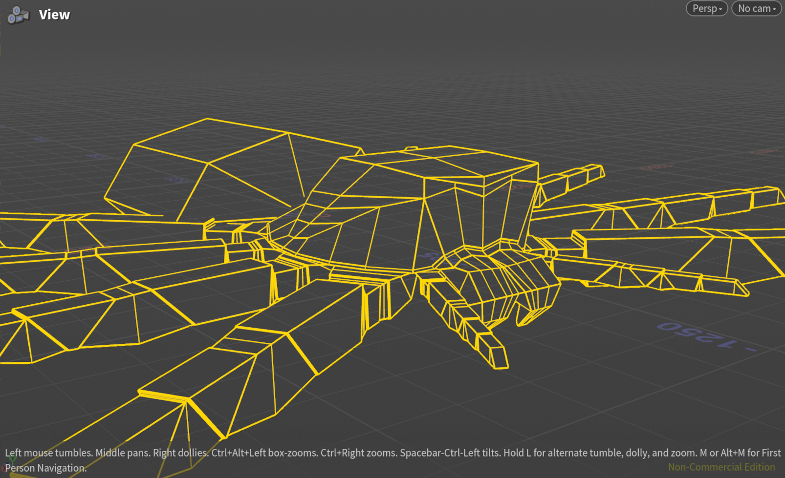
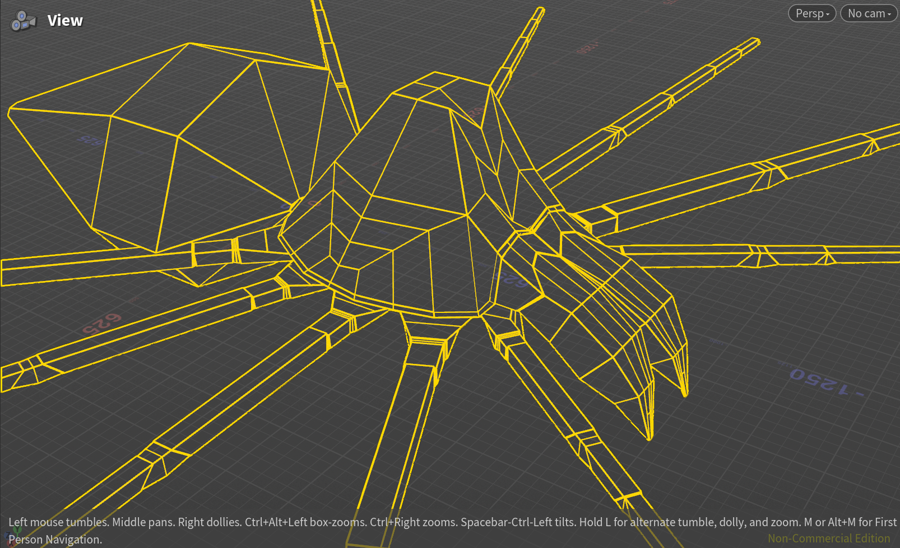
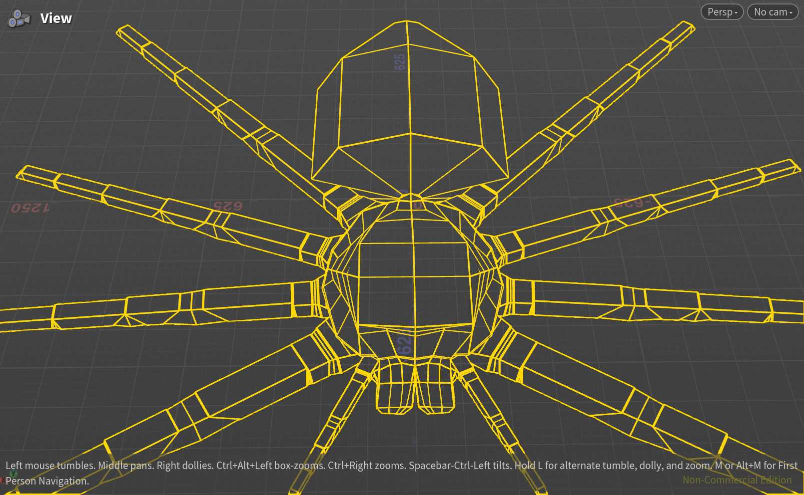
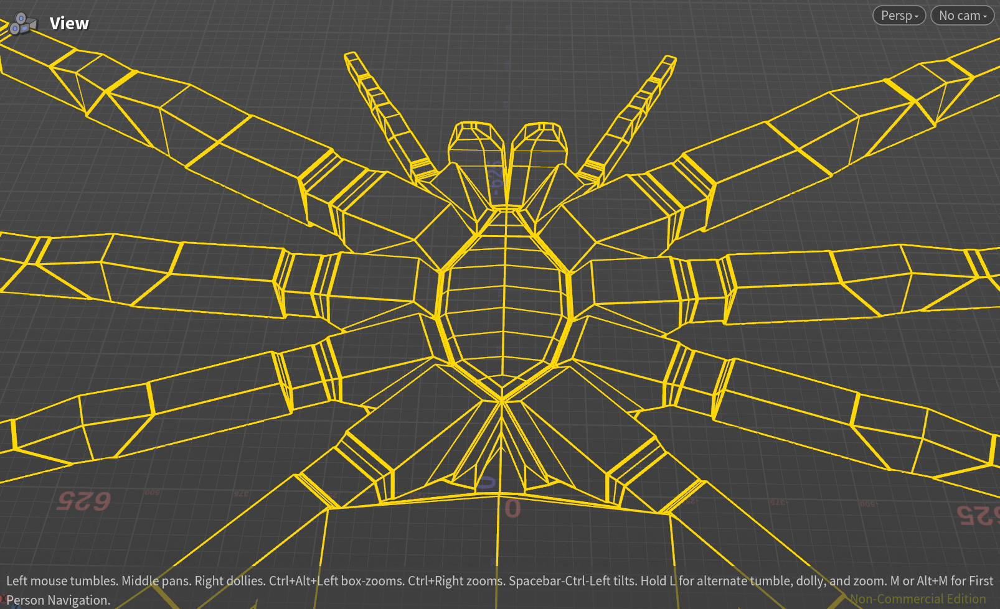
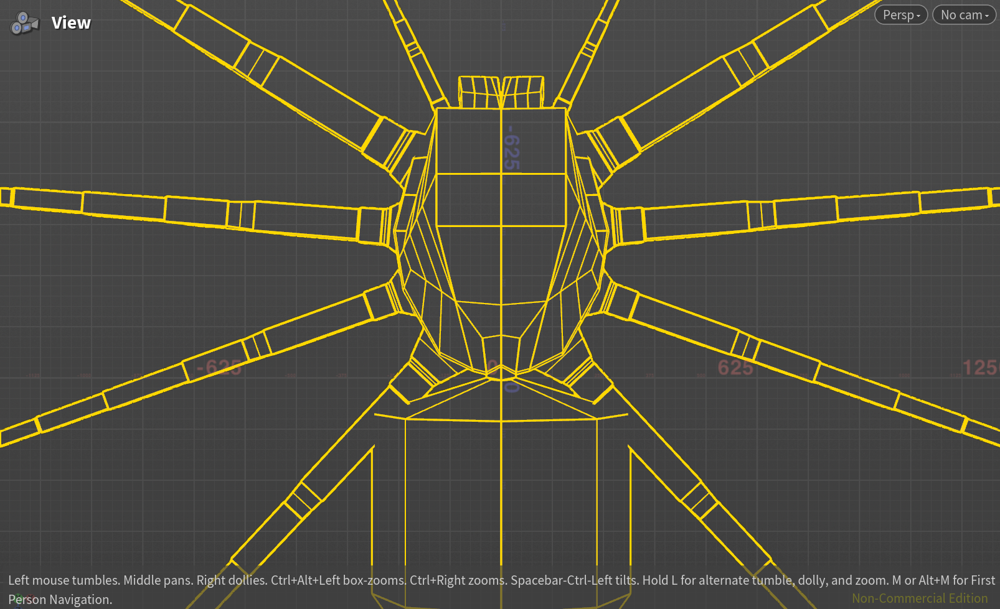
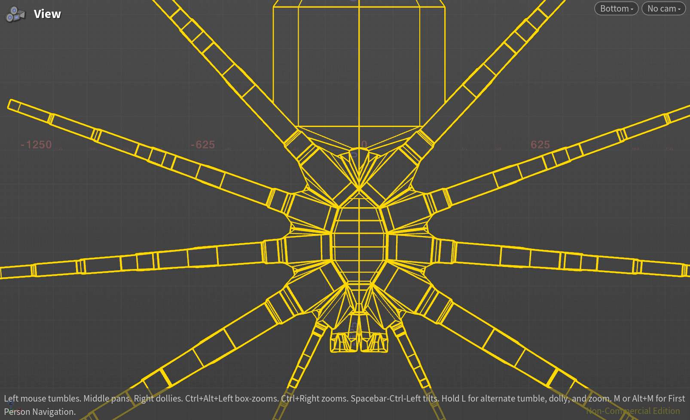

# Houdini Spider Generator

A procedural spider model generator for SideFX Houdini. It builds a biologically plausible spider from Python and Houdini geometry attributes, then exposes the most useful shape and topology controls as editable Houdini parameters.

The final model is built as a Houdini node network, so the construction remains easy to inspect and debug.

Adjust the handles to explore different spider shapes without rebuilding the model by hand.


## How it works

The generator uses Houdini Python to create and connect the modeling network. Point, primitive, and global attributes identify anatomical regions and construction points as geometry moves through the network. The builder modules use those attributes to construct surfaces, connect regions, and expose controls on the generated nodes.

The project uses [`houkit`](https://github.com/red-bean-pasta/houkit) for reusable Houdini node, parameter, attribute, and reloadable-subnet helpers. It is included as a Git submodule and is required at `./houkit`.


## Quick start

You need Houdini with `hython` available on your `PATH`.

```bash
git clone --recurse-submodules https://github.com/red-bean-pasta/houdini-spider-generator.git
cd houdini-spider-generator
```

Build the example Houdini file:

```bash
hython scripts/build_test_hip.py
```

Open `test/test.hip` in Houdini. The generated spider is under `/obj/spider`, with promoted parameters in the `Build` and `Advanced` sections.


## Examples and topology views

Different parameter values can produce noticeably different body proportions and leg arrangements:




Wireframe views of the generated low-poly topology:







## Current limitations and TODOs

- Improve the layout of the control-handle parameters.
- Add a complete subdivision workflow; the authored topology is currently low-poly.
- Add support loops for leg coxas.
- Add eyeballs.
- Add flexing leg support. Legs are segmented and include membranes, but currently extend directly from the body.
- Add leg-segment section variance. Segments currently behave like tubes; the membrane workflow needs narrower ends that grow toward thicker sections.


## Parameter reference

The complete handle set is generated in Houdini from the builder modules. The controls below are the most useful ones for shaping the model.

### Sternum & Base

| Parameter | Default | Description |
| --- | ---: | --- |
| `front_back_length_ratios` | `(1.85, 1.6)` | Anterior and posterior sternum lengths relative to sternum half-width. |
| `spine_depth_ratio` | `0.25` | Maximum center-spine depression relative to sternum half-width. |
| `coxa_flap_extension_ratio` | `1.63` | Outward coxa-flap reach relative to sternum rim-edge length. |
| `coxa_flap_rise_angle` | `12` | Coxa-flap rise angle in degrees. |

### Head

| Parameter | Default | Description |
| --- | ---: | --- |
| `height_ratio` | `0.375` | Head top height relative to the base-to-chelicerae span. |
| `top_width_length_ratios` | `(1.0, 0.4)` | Head top width and front-to-back length/flatness. |
| `top_face_offset_ratio` | `0.0` | Lengthwise offset of the top face. |
| `top_support_loop_ratios` | `(0.2, 0.5)` | Forward and rear placement of the top support loop. Larger values make the head rounder. |
| `chelicerae_height_ratio` | `0.35` | Height of the upper chelicerae line relative to the base. |
| `lip_extrusion_ratio` | `(5.0, 1.0)` | Lengthwise and vertical lip extrusion. |

### Abdomen

| Parameter | Default | Description |
| --- | ---: | --- |
| `size_ratios` | `(1.2, 1.0, 1.2)` | Abdomen width, height, and length relative to the cephalothorax. |
| `width_hold_ratios` | `(0.1, 0.6)` | Start and end of the constant-width region along the abdomen. |
| `end_size_ratio` | `0.2` | Terminal abdomen width and height relative to its maximum size. This represents the spinnet. |

### Pedicel

| Parameter | Default | Description |
| --- | ---: | --- |
| `pedicel_opening_ratios` | `(0.5, 0.5)` | Controls the side/upper opening proportion and the lower opening position of the pedicel. |

### Chelicerae

| Parameter | Default | Description |
| --- | ---: | --- |
| `end_section_ratio` | `(0.25, 0.25)` | End-section width and height relative to the start section. |
| `end_section_offset` | `(0.2, 3.15, 1.25)` | End-section offset in local width, height, and length directions. |
| `end_section_rotation` | `(-90.0, 0.0)` | End-section rotation in the two local rotation directions. |
| `middle_section_ratio` | `(1.0, 1.2)` | Middle-section width and height relative to the start section. |
| `middle_section_offset` | `(0.1, 2.25)` | Middle-section offset in the local width and length directions. |
| `middle_section_height_ratio` | `0.4` | Middle-section height between the start and end sections. |

### Legs: basic and main legs

| Parameter | Default | Description |
| --- | ---: | --- |
| `front_coxa_width_length_ratios` | `(0.75, 1.2)` | Front coxa width and length relative to the front socket width. |
| `coxa_trochanter_height_ratio` | `0.63` | Trochanter height-to-width proportion. |
| `other_segment_height_ratio` | `1.15` | Height-to-width proportion of post-trochanter segments. |
| `front_segment_length_ratios` | `(0.33, 1.5, 0.9, 1.2, 1, 0.7)` | Length of each post-coxa front-leg segment relative to front coxa length. |
| `min_flex_angles` | `(180, 200, 30, 95, 150, 170)` | Minimum flex angle for each post-coxa segment joint. |
| `max_yaw_angles` | `(25, 0, 0, 0, 0, 20)` | Maximum yaw angle for each post-coxa segment joint. |
| `other_leg_width_ratios` | `(0.8, 0.7, 0.8)` | Coxa-width scale for legs 2–4 relative to the front coxa. |
| `other_leg_length_ratios` | `(0.88, 0.9, 1.1)` | Coxa-length scale for legs 2–4 relative to the front coxa. |

### Pedipalp

| Parameter | Default | Description |
| --- | ---: | --- |
| `pedipalp_coxa_length` | `0.8` | Pedipalp coxa length relative to the front-leg coxa length. |
| `pedipalp_segment_length_ratios` | `(0.17, 0.8, 0.4, 0.45, 0.4)` | Length of each post-coxa pedipalp segment relative to pedipalp coxa length. |
| `endite_length_ratio` | `0.95` | Endite extension from its membrane attachment toward the coxa. |


## License

This project is licensed under the [MIT License](LICENSE).


## Acknowledgements

This project is manually directed, reviewed, structured, and tested at the method level. AI assists with implementation within that process.
